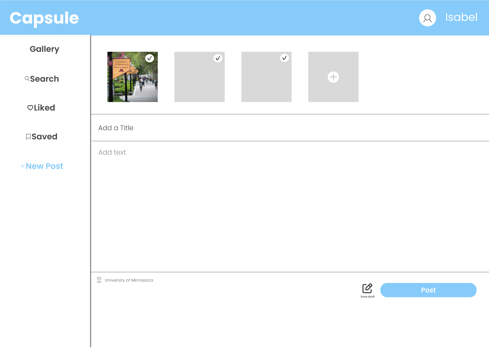
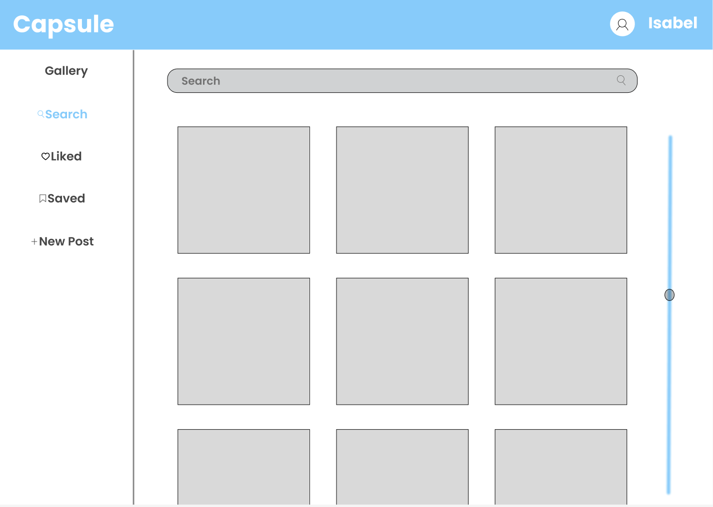
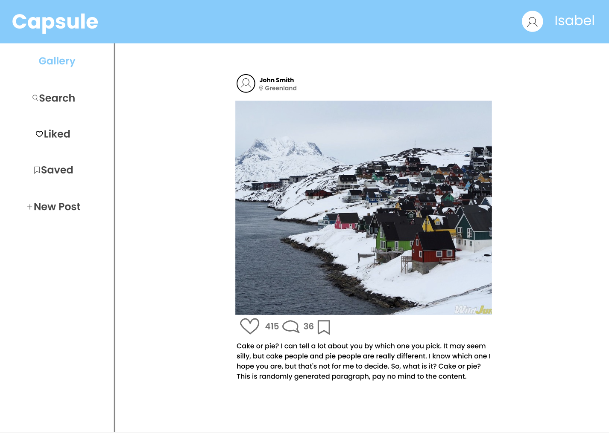
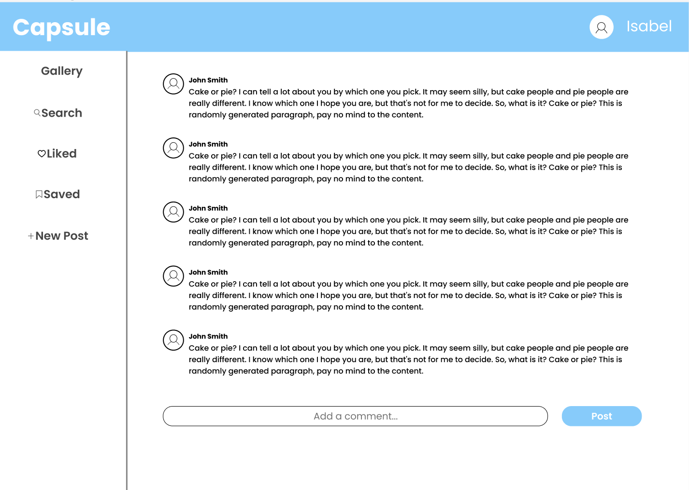

# Module 1 Group Assignment

CSCI 5117, Spring 2023, [assignment description](https://canvas.umn.edu/courses/355584/pages/project-1)

## App Info:

This is dev branch.

- Team Name: Capsule
- App Name: Capsule

- App Link (deploy on dev branch): 

https://capsule-igtc.onrender.com

### Students

- Youfu Yan, yan00111@umn.edu
- Isabel Dahl, dahl1199@umn.edu
- Marcellinus, Steven Sugiarto sugia005@umn.edu
- Ying Lu, lu000097@umn.edu
- Ola Oladeji, olade014@umn.edu

## Key Features

**Describe the most challenging features you implemented
(one sentence per bullet, maximum 4 bullets):**

- ...

## Testing Notes

**Is there anything special we need to know in order to effectively test your app? (optional):**

- testing comments page: https://capsule-igtc.onrender.com/comments

## Screenshots of Site

**[Add a screenshot of each key page (around 4)](https://stackoverflow.com/questions/10189356/how-to-add-screenshot-to-readmes-in-github-repository)
along with a very brief caption:**

## Mock-up

There are a few tools for mock-ups. Paper prototypes (low-tech, but effective and cheap), Digital picture edition software (gimp / photoshop / etc.), or dedicated tools like moqups.com (I'm calling out moqups here in particular since it seems to strike the best balance between "easy-to-use" and "wants your money" -- the free teir isn't perfect, but it should be sufficient for our needs with a little "creative layout" to get around the page-limit)

In this space please either provide images (around 4) showing your prototypes, OR, a link to an online hosted mock-up tool like moqups.com

https://www.figma.com/file/t4tzlTlzw1cuJrDizenWRE/Capsule-Prototype?node-id=0%3A1&t=Ao2MbAzyLNCByPPH-1

### Preview

## External Dependencies

**Document integrations with 3rd Party code or services here.
Please do not document required libraries. or libraries that are mentioned in the product requirements**

- Library or service name: description of use
- ...

**If there's anything else you would like to disclose about how your project
relied on external code, expertise, or anything else, please disclose that
here:**

...
